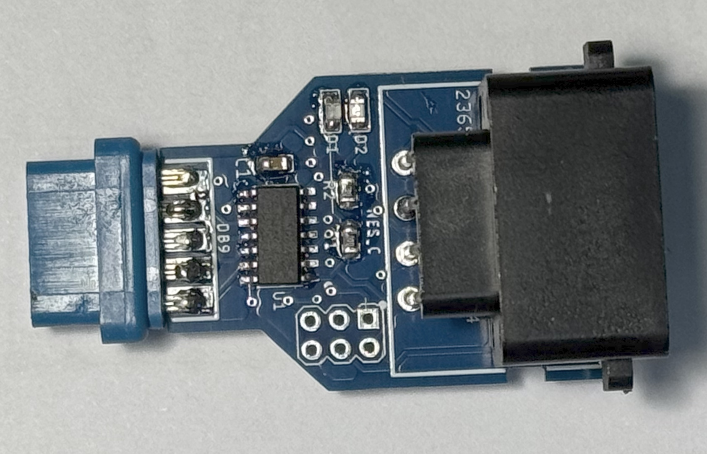

# NES2MSX

## Description
Converter for NES controllers (7-pin connector) to MSX standard.

## Acknowledgments
- David A. Mellis for his ATtiny board library (https://github.com/damellis/attiny).
- Josh Marinacci for his NESpad library (https://github.com/joshmarinacci/nespad-arduino).

## Why?
This project was born out of the difficulty of finding comfortable and accessible (and also affordable 🤑) controllers for MSX computers.  
But instead of destroying a NES controller, I decided to make this converter — that way I could also use other NES-style controllers such as those from 8Bitdo.

## Images
### PCB
  

### Assembled PCB

