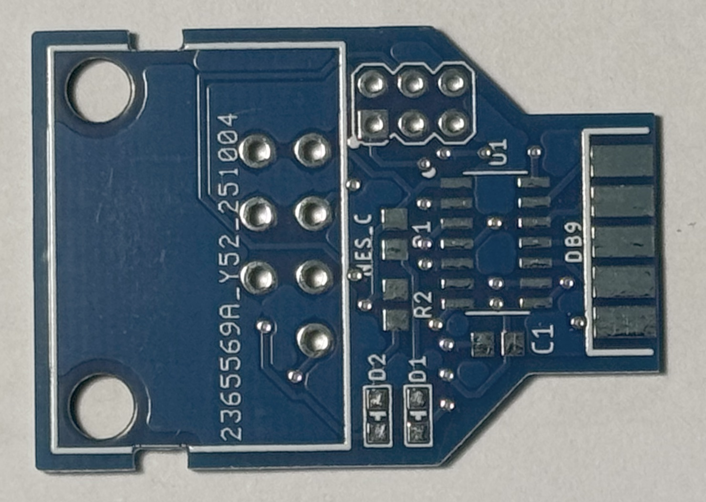
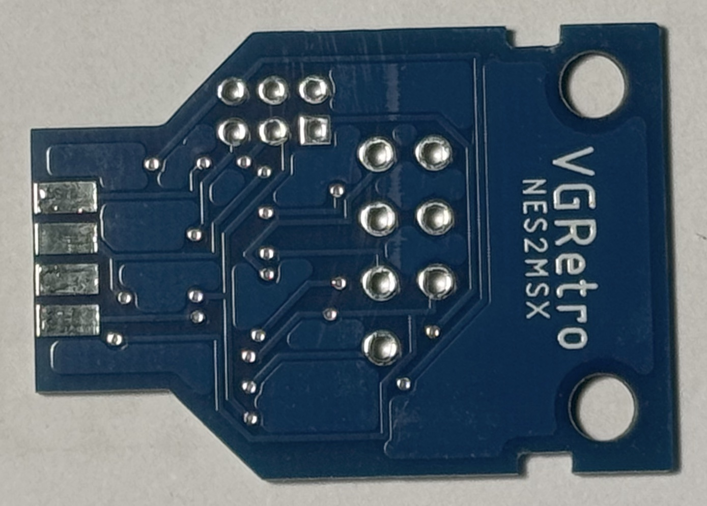

# NES2MSX

## Descripción
Conversor de mandos de NES (connector de 7 pines) a estándar MSX.

## Agradecimientos
- David A. Mellis por su librería de placas para los ATtiny (https://github.com/damellis/attiny).
- Josh Marinacci por su librería NESpad (https://github.com/joshmarinacci/nespad-arduino).

## ¿Porqué?
Este proyecto surgió debido a la dificultad de poder encontrar mandos cómodos y accesibles (y también asequibles 🤑) para los ordenadores MSX. Pero en vez de destrozar un mando de NES decidí hacer este conversor, así también podría usar otros mandos de NES como los de 8Bitdo.

## Imágenes
### PCB

### PCB ensamblada
